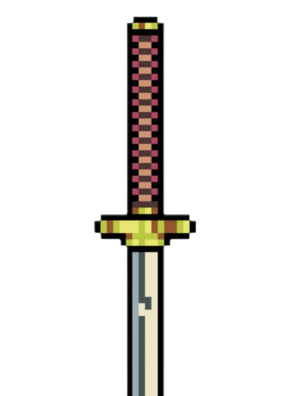
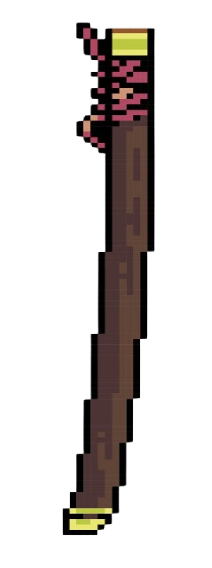

<!-- BANNER -->

<!-- TITLE -->
<h2 align="center">  Hey there, I'm <a href="https://github.com/DevnisG">Devnis</a> - (Denis Gontero), an Automation Specialist. </h2>

<!-- KATANA -->

Unsheathe Profile

 

  <ul style="list-style-type: none; padding-left: 0;">
    <li style="font-size: 18px; margin: 10px 0;"><strong style="color: #e6a800;">Age:</strong> 24 years old</li>
    <li style="font-size: 18px; margin: 10px 0;"><strong style="color: #e6a800;">Passion:</strong> ADD </li>
    <li style="font-size: 18px; margin: 10px 0;"><strong style="color: #e6a800;">Profession:</strong> Automation Specialist</li>
    <li style="font-size: 18px; margin: 10px 0;"><strong style="color: #e6a800;">Role:</strong> Computer Technician</li>
    <li style="font-size: 18px; margin: 10px 0;"><strong style="color: #e6a800;">IT Support Specialist</strong> ADD </li>
    <li style="font-size: 18px; margin: 10px 0;"><strong style="color: #e6a800;">App Developer:</strong> Windows, Android, MacOS, and Linux</li>
    <li style="font-size: 18px; margin: 10px 0;"><strong style="color: #e6a800;">Interests:</strong> ADD </li>
  </ul>

<!-- SAYA -->

	
