<!-- BANNER -->
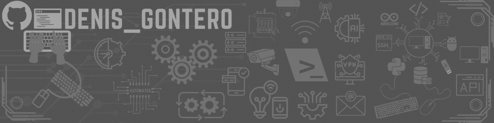

<!-- TITLE -->
<h2 align="center">
  ,
   Soy <a href="https://github.com/DevnisG">DevnisG</a> - Desarrollador Python / Backend / Especialista en Automatización / Entusiasta de IoT y Domótica. 
</h2>

<!-- FOLLOWERS COUNT -->

  

<!-- GIF -->

<!-- ABOUT ME -->
 Hola, soy Denis Gontero.  

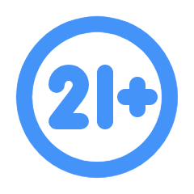 Edad: 26 años.  

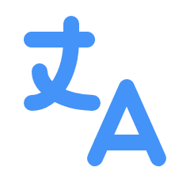 Idiomas: Español e Inglés.

 Ubicación: Argentina.

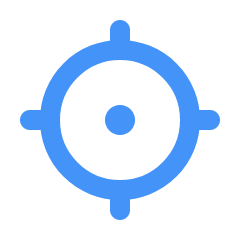 Objetivo: Mi enfoque se centra en el desarrollo de soluciones que optimicen procesos tecnológicos y el rendimiento de sistemas.

Proyecto Open Source:

 <a href="https://github.com/DevnisG/homet" target="_blank">H.O.M.E.T</a> - Una aplicación para optimizar las temperaturas y el rendimiento de CPUs, utilizando Python, Flet, Pythonnet y FastAPI.

Proyecto Para Python Community:

 <a href="https://github.com/DevnisG/delpyche" target="_blank">Delpyche</a> - Una aplicación para hacer Tracking a el cache generado por Python y eliminarlo automaticamente.

 <a href="https://github.com/DevnisG/Venvmnu" target="_blank">Venmnu</a> - Una app tipo CLI para administrar entornos Venv.

SDK Open Source: 

 <a href="https://github.com/DevnisG/sdk-youtube-control" target="_blank">S.Y.C</a> - SDK para control programático del reproductor de YouTube mediante iFrame y YouTube API v3.

¿Te interesa colaborar?

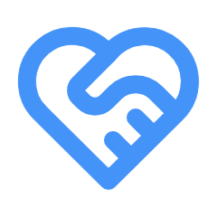 Estoy disponible para trabajos freelance en automatización, hardware, software y tecnología en general.

Contáctame:

 denis.gontero.2000@gmail.com

<!-- SEPARATOR -->

 
   

<!-- GHUB STATS -->
Estadisticas:

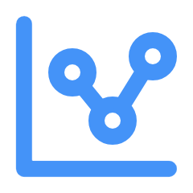 <a href="https://github.com/DevnisG" target="_blank">GitHub: </a> 

  

  <a href="https://github.com/DevnisG/">
    

  

<!-- SEPARATOR -->

 

<!-- LANGS & TOOLS -->
Stack & Tecnologías: 

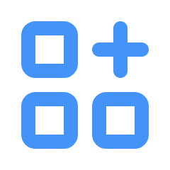 <a href="https://github.com/DevnisG" target="_blank">Stack: </a> 
  

  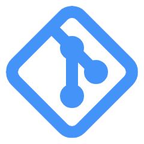 &nbsp;&nbsp;
  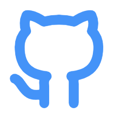 &nbsp;&nbsp;
   &nbsp;&nbsp;
   &nbsp;&nbsp;
   &nbsp;&nbsp;
  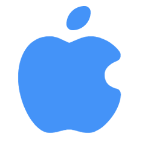 &nbsp;&nbsp;
   &nbsp;&nbsp;
  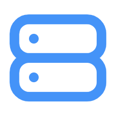 &nbsp;&nbsp;
  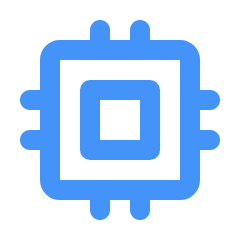 &nbsp;&nbsp;
  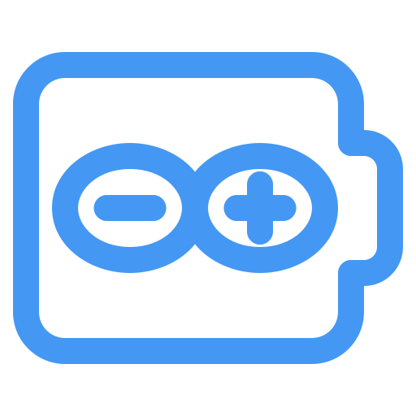 &nbsp;&nbsp;
  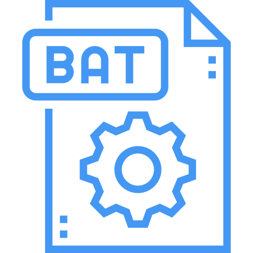 &nbsp;&nbsp;
  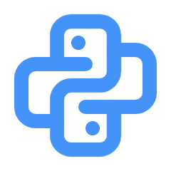 &nbsp;&nbsp;
   &nbsp;&nbsp;
   &nbsp;&nbsp;
  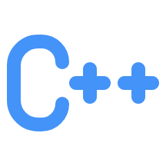 &nbsp;&nbsp;
    

<!-- SEPARATOR -->

 

<!-- SOCIAL MEDIA -->
Redes:

 <a href="denis.gontero.2000@gmail.com" target="_blank">Redes Sociales: </a> 

 &nbsp;&nbsp;
 &nbsp;&nbsp;
 &nbsp;&nbsp;
 &nbsp;&nbsp;

<!-- FOOTER -->

 
<h2 align="center"> CODE  / SLEEP  / EAT  / REPEAT </h2>

